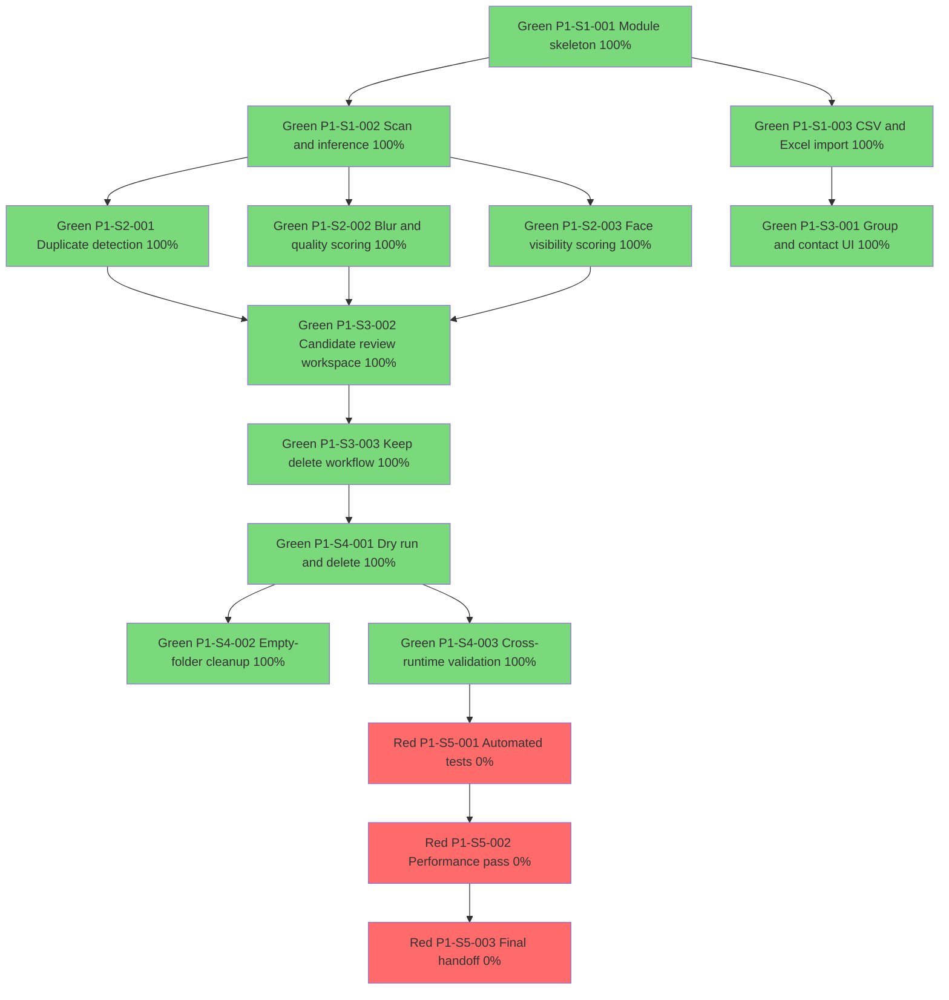

# Kiro Spec - Code Completion Graph

## Traceability
- Task source: [tasks.md](tasks.md)
- Requirement source: [requirements.md](requirements.md)
- Design source: [design.md](design.md)

## Sequence Index
- GSEQ-001 (2026-06-26): Gallery specification set initialized and execution graph created.
- GSEQ-002 (2026-06-26): Completed [P1-S1-001] gallery module skeleton and adapter contracts.
- GSEQ-003 (2026-06-26): Completed [P1-S1-002] folder scan and source inference baseline.
- GSEQ-004 (2026-06-26): Completed [P1-S1-003] CSV and Excel import pipeline with fallback naming.
- GSEQ-005 (2026-06-26): Completed [P1-S2-001] duplicate detection engine (exact and perceptual).
- GSEQ-006 (2026-06-26): Completed [P1-S2-002] blur and low-quality scoring heuristics.
- GSEQ-007 (2026-06-26): Completed [P1-S2-003] face visibility scoring integration.
- GSEQ-008 (2026-06-26): Completed [P1-S3-001] group-first contact UI data model.
- GSEQ-009 (2026-06-26): Completed [P1-S3-002] candidate review and side-by-side compare workspace services.
- GSEQ-010 (2026-06-26): Completed [P1-S3-003] keep/delete decision workflow with undo ticket model.
- GSEQ-011 (2026-06-26): Completed [P1-S4-001] dry-run and confirmed delete execution services.
- GSEQ-012 (2026-06-26): Completed [P1-S4-002] empty-folder cleanup pass.
- GSEQ-013 (2026-06-26): Completed [P1-S4-003] cross-runtime adapter validation flow.

## Update Protocol
After each successful task completion:
1. Append a new sequence entry with incremented GSEQ id.
2. Update task node status and completion percentage.
3. Keep dependency links in sync with [tasks.md](tasks.md).

## Dependency Graph

## Progress Summary
- Total tasks: 14
- Completed tasks: 11
- Completion: 79%
- Credit governance: maximum 93% usage, minimum 7% reserve.
