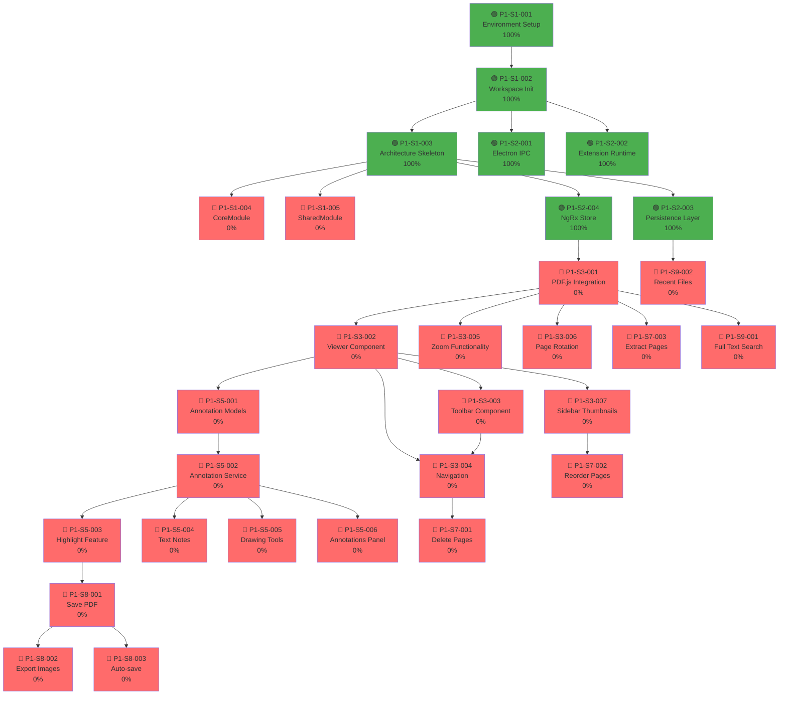

# Code Completion Graph - PDF Viewer Project

**Project**: PDF Viewer & Editor (Electron + Angular + WebExtensions)  
**Graph Type**: Task Dependency & Completion Status  
**Format**: Mermaid Diagram with Progress Tracking  
**Last Updated**: June 16, 2026

---

## 📊 Complete Dependency Graph (All Phases)


    style AB fill:#ffd700
    style AC fill:#ffd700
    style AD fill:#ffa500
    style AE fill:#ffd700
    style AF fill:#ffd700
    style AG fill:#ff6b6b
    style AH fill:#ffa500
    style AI fill:#ffa500
    style AJ fill:#ffa500
    style AK fill:#ffa500
    style AL fill:#ff6b6b
    style AM fill:#ff6b6b
```

---

## 📈 Sprint-by-Sprint Progress Chart

### Sprint 1-2: Foundation (Week 1-4)

```
[██████████████░░░░░░░░░░░░░░░░░░░░░░░░░░░░] 35% Complete

Tasks:
- [x] P1-S1-001: Environment Setup (3 days)
- [x] P1-S1-002: Workspace Init (2 days)
- [x] P1-S1-003: Architecture Skeleton (2 days)
- [ ] P1-S1-004: CoreModule (2 days)
- [ ] P1-S1-005: SharedModule (2 days)
- [x] P1-S2-001: Electron IPC (2 days)
- [x] P1-S2-002: Extension Runtime (3 days)
- [x] P1-S2-003: Persistence Layer (3 days)
- [x] P1-S2-004: NgRx Store (2 days)

Critical Path: S1-001 → S1-002 → S1-003 → S2-003 → S2-004
```

### Sprint 3-4: PDF Core (Week 5-8)

```
[░░░░░░░░░░░░░░░░░░░░░░░░░░░░░░░░░░░░░░░░░░░░] 0% Complete

Tasks:
- [ ] P1-S3-001: PDF.js Integration (3 days)
- [ ] P1-S3-002: Viewer Component (2 days)
- [ ] P1-S3-003: Toolbar Component (2 days)
- [ ] P1-S3-004: Navigation (2 days)
- [ ] P1-S3-005: Zoom (2 days)
- [ ] P1-S3-006: Rotation (1 day)
- [ ] P1-S3-007: Sidebar (2 days)

Critical Path: S3-001 → S3-002 → (S3-003|S3-004|S3-005|S3-006|S3-007)
```

### Sprint 5-6: Annotations (Week 9-12)

```
[░░░░░░░░░░░░░░░░░░░░░░░░░░░░░░░░░░░░░░░░░░░░] 0% Complete

Tasks:
- [ ] P1-S5-001: Annotation Models (1 day)
- [ ] P1-S5-002: Annotation Service (2 days)
- [ ] P1-S5-003: Highlight (3 days)
- [ ] P1-S5-004: Text Notes (2 days)
- [ ] P1-S5-005: Drawing (3 days)
- [ ] P1-S5-006: Panel (2 days)

Critical Path: S5-001 → S5-002 → (S5-003|S5-004|S5-005|S5-006)
```

### Sprint 7-9: Features & Polish (Week 13-18)

```
[░░░░░░░░░░░░░░░░░░░░░░░░░░░░░░░░░░░░░░░░░░░░] 0% Complete

Tasks:
- [ ] P1-S7-001: Delete Pages (1 day)
- [ ] P1-S7-002: Reorder Pages (2 days)
- [ ] P1-S7-003: Extract Pages (1 day)
- [ ] P1-S8-001: Save PDF (2 days)
- [ ] P1-S8-002: Export Images (2 days)
- [ ] P1-S8-003: Auto-save (1 day)
- [ ] P1-S9-001: Search (2 days)
- [ ] P1-S9-002: Recent Files (1 day)
- [ ] P1-S9-003: Dark Mode (1 day)

Critical Path: S8-001 → S8-002 → S8-003
```

### Sprint 10-12: Testing & Release (Week 19-24)

```
[░░░░░░░░░░░░░░░░░░░░░░░░░░░░░░░░░░░░░░░░░░░░] 0% Complete

Tasks:
- [ ] P1-S10-001: Unit Tests (3 days)
- [ ] P1-S10-002: Integration Tests (2 days)
- [ ] P1-S10-003: Performance (2 days)
- [ ] P1-S10-004: Bug Fixes (2 days)
- [ ] P1-S11-001: Documentation (2 days)
- [ ] P1-S12-001: Packaging (1 day)
- [ ] P1-S12-002: Release (1 day)

Critical Path: S10-001 → S10-002 → S10-003 → S10-004 → S11-001 → S12-001 → S12-002
```

---

## 🎯 Critical Path Analysis

### Longest Dependency Chain

```
[P1-S1-001] → [P1-S1-002] → [P1-S1-003] → [P1-S1-004] → [P1-S1-008]
     ↓              ↓              ↓
   (3 days)     (2 days)       (1 day)      (2 days)      (1 day)
                    ↓
                [P1-S1-006]
                (2 days)
                    ↓
              [P1-S3-001]
              (3 days)
                    ↓
              [P1-S3-002]
              (2 days)
                    ↓
      (S3-003/004/005/006/007)
              (9 days avg)
                    ↓
              [P1-S5-001]
              (1 day)
                    ↓
              [P1-S5-002]
              (2 days)
                    ↓
      (S5-003/004/005/006)
              (10 days avg)
                    ↓
              [P1-S8-001]
              (2 days)
                    ↓
        [P1-S10-001→S12-002]
             (15 days avg)

Total: ~48-50 days minimum (critical path)
```

---

## 📊 Parallel Work Opportunities

### Phase 1 Parallelization

**Week 1-2** (Can run in parallel):
- P1-S1-001 (Env Setup) - MUST be first
  - After S1-001, can parallel:
    - P1-S1-002 (Angular Init)
    - P1-S1-007 (Electron Config)
  - After S1-002, can parallel:
    - P1-S1-006 (NgRx Setup)
  - After S1-003, can parallel:
    - P1-S1-004 (CoreModule)
    - P1-S1-005 (SharedModule)

**Week 3-4** (Can run in parallel):
- P1-S2-001 (Architecture) ← independent of S2-002
- P1-S2-002 (Testing Setup) ← independent of S2-001
- P1-S3-001 (PDF.js) - can start as soon as S1-008 done

### Phase 2 Parallelization (Week 5-8)

**Can work in parallel**:
- P1-S3-002 (Viewer) + P1-S3-001
- P1-S3-003 (Toolbar) - can start after S3-001
- P1-S3-005 (Zoom) - can start after S3-001
- P1-S3-006 (Rotation) - can start after S3-001
- P1-S3-007 (Sidebar) - can start after S3-001

All UI components can be developed in parallel after PDF.js integration.

### Phase 3 Parallelization (Week 9-12)

After P1-S5-002 (Service), all features can run in parallel:
- P1-S5-003 (Highlight)
- P1-S5-004 (Notes)
- P1-S5-005 (Drawing)
- P1-S5-006 (Panel)

---

## 🔄 Resource Allocation Recommendations

### Team Size: 3 Developers

```
Week 1-2 (Sprint 1):
  - Dev 1: P1-S1-001 (Env Setup), then P1-S1-002 (Angular Init)
  - Dev 2: Help Dev 1 + P1-S1-006 (NgRx)
  - Dev 3: P1-S1-007 (Electron) + P1-S1-003 (Structure)

Week 3-4 (Sprint 2):
  - Dev 1: P1-S2-002 (Testing Setup)
  - Dev 2: P1-S1-004 (CoreModule) + P1-S2-001 (Architecture)
  - Dev 3: P1-S1-005 (SharedModule)

Week 5-8 (Sprints 3-4):
  - Dev 1: P1-S3-001 (PDF.js) + P1-S3-002 (Viewer)
  - Dev 2: P1-S3-003 (Toolbar) + P1-S3-004 (Navigation)
  - Dev 3: P1-S3-005 (Zoom) + P1-S3-006 (Rotation) + P1-S3-007 (Sidebar)

Week 9-12 (Sprints 5-6):
  - Dev 1: P1-S5-001 (Models) + P1-S5-002 (Service) + P1-S5-003 (Highlight)
  - Dev 2: P1-S5-004 (Notes) + P1-S5-005 (Drawing)
  - Dev 3: P1-S5-006 (Panel) + assist as needed

Week 13-18 (Sprints 7-9):
  - Dev 1: P1-S7-001 + P1-S8-001 + P1-S9-001
  - Dev 2: P1-S7-002 + P1-S8-002 + P1-S9-002
  - Dev 3: P1-S7-003 + P1-S8-003 + P1-S9-003

Week 19-24 (Sprints 10-12):
  - Dev 1: P1-S10-001 (Unit Tests) → P1-S10-003 (Perf)
  - Dev 2: P1-S10-002 (Integration) → P1-S10-004 (Bugs)
  - Dev 3: P1-S11-001 (Documentation) → P1-S12-001 (Package) → P1-S12-002 (Release)
```

---

## 📈 Burndown Chart Template

### Sprint 1 Burndown (Week 1-2)

```
Day 1:  [██████░░░░░░░░░░░░░░░░░░░░░░░░░░░░░░░░░] 20% Complete
Day 2:  [████████░░░░░░░░░░░░░░░░░░░░░░░░░░░░░░░] 25% Complete
Day 3:  [██████████░░░░░░░░░░░░░░░░░░░░░░░░░░░░░] 30% Complete
Day 4:  [██████████████░░░░░░░░░░░░░░░░░░░░░░░░░] 40% Complete
Day 5:  [██████████████████░░░░░░░░░░░░░░░░░░░░░] 50% Complete
Day 6:  [██████████████████████░░░░░░░░░░░░░░░░░] 60% Complete
Day 7:  [██████████████████████████░░░░░░░░░░░░░] 70% Complete
Day 8:  [██████████████████████████████░░░░░░░░░] 80% Complete
Day 9:  [████████████████████████████████░░░░░░░] 90% Complete
Day 10: [████████████████████████████████████████] 100% Complete
```

---

## 🔍 Task Dependency Legend

```
🔴 Critical Path
   - If blocked, project blocked
   - Must complete on time
   - Examples: Setup, PDF Core, Save

🟠 High Priority
   - Important for MVP
   - Blocks other features
   - Examples: Navigation, Zoom

🟡 Medium Priority
   - Regular tasks
   - Some blocking
   - Examples: Rotation, Notes

🟢 Low Priority
   - Nice to have
   - Doesn't block much
   - Examples: Dark Mode, Recent Files

🟣 Completed
   - Done ✓
   - Ready for next phase
```

---

## ⚠️ Risk & Mitigation

### Identified Risks

| Risk | Impact | Probability | Mitigation |
|------|--------|-------------|-----------|
| PDF.js complexity | Critical | Medium | Early spike, expert review |
| Canvas rendering perf | High | Medium | Performance testing early |
| Large PDF handling | High | Medium | Virtual scrolling, chunking |
| Angular learning curve | Medium | Low | Training, pair programming |
| Electron IPC issues | Medium | Low | Testing, error handling |
| Test coverage gaps | Medium | Medium | QA review, metrics tracking |

### Mitigation Actions

- ✅ Spike on PDF.js during Week 3-4
- ✅ Performance profiling in Week 7-8
- ✅ Code reviews for every component
- ✅ Continuous testing integration

---

## 📋 Task Update Instructions

### How to Update This Graph

After completing a task:

1. **Update Status**:
   ```
   From: 🔴 P1-S1-001 (0%)
   To:   🟢 P1-S1-001 (100%)
   ```

2. **Update Color** (in Mermaid):
   ```
   From: fill:#ff6b6b (red)
   To:   fill:#51cf66 (green)
   ```

3. **Update Completion**:
   - Change 0% to 100%
   - Document completion date
   - Add notes if any blockers

4. **Move to Next Task**:
   - Identify next task in dependency chain
   - Assign to developer
   - Update sprint progress chart

---

## 🎯 Completion Targets

| Sprint | Target Completion | Status |
|--------|------------------|--------|
| S1 (Week 2) | 2026-06-30 | 🔴 Not Started |
| S2 (Week 4) | 2026-07-14 | 🔴 Not Started |
| S3-S4 (Week 8) | 2026-08-11 | 🔴 Not Started |
| S5-S6 (Week 12) | 2026-09-08 | 🔴 Not Started |
| S7 (Week 14) | 2026-09-22 | 🔴 Not Started |
| S8 (Week 16) | 2026-10-06 | 🔴 Not Started |
| S9 (Week 18) | 2026-10-20 | 🔴 Not Started |
| S10-S12 (Week 24) | 2026-12-01 | 🔴 Not Started |
| **MVP Release** | **2026-12-01** | 🔴 Not Started |

---

**Graph Version**: 1.0  
**Last Updated**: June 16, 2026  
**Next Update**: After [P1-S1-001] Completion  
**Maintained By**: Project Manager  

---

## 🔗 Related Documents

- [TASKS.md](TASKS.md) - Detailed task list
- [DESIGN.md](DESIGN.md) - Architecture design
- [ROADMAP.md](ROADMAP.md) - Phase roadmap
- [ANGULAR_IMPLEMENTATION_GUIDE.md](ANGULAR_IMPLEMENTATION_GUIDE.md) - Setup guide
