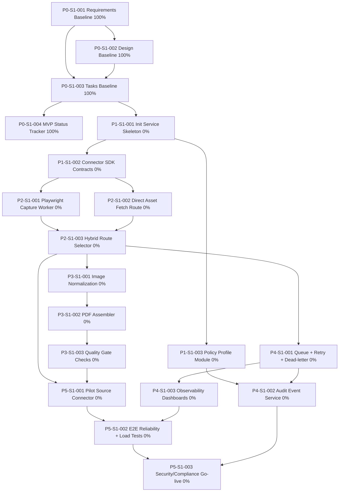

# Epaper Extraction Project - Code Completion Graph

## Purpose
Track execution progress from tasks, visualize dependencies, and maintain an append-only sequence index for completed updates.

## Source of Truth
- Task execution source: tasks.md
- Rule: after each successful task completion, update both tasks.md and this graph document.

## Sequence Index
- GSEQ-001 | 2026-06-29 | Graph initialized for epaper-extraction execution tracking.
- GSEQ-002 | 2026-07-01 | Refined requirements baseline and added traceable specification task.
- GSEQ-003 | 2026-07-01 | Refined design and tasks baselines and created MVP completion status tracker.

## Current Overall Status
- Total tasks: 19
- Completed tasks: 4
- In-progress tasks: 0
- Blocked tasks: 0
- Completion: 21.05%

## Task Dependency Graph

## Phase Progress
- Phase 0: 4/4 (100%)
- Phase 1: 0/3 (0%)
- Phase 2: 0/3 (0%)
- Phase 3: 0/3 (0%)
- Phase 4: 0/3 (0%)
- Phase 5: 0/3 (0%)

## Update Protocol
1. On every task completion in tasks.md, update the matching node percentage here.
2. Recalculate phase and overall completion values.
3. Append a new sequence line in Sequence Index:
- Format: GSEQ-XXX | YYYY-MM-DD | Summary
4. Keep this file append-only for sequence history.
